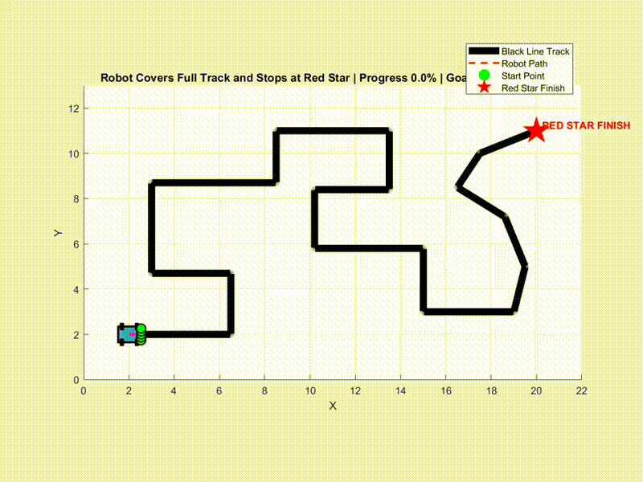

# 🤖 Fuzzy Logic Line-Following Robot With Red Star Finish


A MATLAB-based autonomous robot simulation using a **five-sensor fuzzy logic controller** for complete track following and intelligent red-star endpoint navigation.

The robot follows the complete black-line route, reaches the final red-star destination, and automatically stops after successful endpoint detection.

---

# 🎥 Simulation Demo



---

# ✨ Features

This project includes:

- ✅ Five-sensor fuzzy line-following controller
- ✅ Differential drive robot model
- ✅ Complete track navigation
- ✅ Green start point detection
- ✅ Red-star endpoint detection
- ✅ Smooth steering control
- ✅ Bigger robot body and wheels
- ✅ Track progress monitoring
- ✅ Red-star distance analysis
- ✅ Robot animation
- ✅ Simulation video recording

---

# 📌 Project Overview

This project demonstrates an autonomous mobile robot controlled by a fuzzy logic system.

The robot uses five virtual sensors to detect the black line position and calculate the tracking error. The fuzzy controller processes this error and generates appropriate wheel velocity commands to keep the robot on the path.

The complete system contains:

- Sensor reading module
- Fuzzy logic steering controller
- Differential drive motion model
- Track progress monitoring
- Endpoint approach controller
- Robot visualization and animation

The robot must complete the entire track before approaching the red-star finish point.

---

# 🧠 Control Architecture

```
Line Sensors
      |
      ↓
Error Calculation
      |
      ↓
Fuzzy Logic Controller
      |
      ↓
Wheel Velocity Commands
      |
      ↓
Differential Drive Robot
      |
      ↓
Track Following
      |
      ↓
Red Star Approach
      |
      ↓
Stop
```

---

# 🛣️ Track Design

The latest version includes a cleaner full route with:

- Long straight paths
- Smooth turning sections
- Green starting position
- Red-star final destination

Robot configuration:

```
Start Point  : Bottom-left
Finish Point : Top-right (Red Star)
```

The robot follows the complete track before entering the final endpoint approach mode.

---

# 🎯 Endpoint Controller

The final approach controller allows the robot to reach the red-star destination accurately.

Robot operation:

```
Start Position
       ↓
Follow Black Line
       ↓
Complete Full Track
       ↓
Activate Endpoint Controller
       ↓
Move Toward Red Star
       ↓
Stop Automatically
```

---

# 🔒 Full Track Protection

This version prevents shortcut behavior.

Improvements:

- Track progress remains monotonic
- Endpoint mode cannot activate early
- Robot must complete the full route
- Final stopping occurs only at the red star

---

# 🚀 How to Run

## Requirements

- MATLAB R2020a or newer recommended
- Basic MATLAB plotting support

---

## Run Simulation

Open MATLAB.

Set this repository folder as the current working folder.

Run:

```matlab
main
```

The simulation will start automatically.

---

# 📂 Repository Structure

```
Fuzzy-Line-Following-Robot-MATLAB
│
├── main.m
├── robot_config.m
├── create_track.m
├── read_line_sensors.m
├── fuzzy_controller.m
├── differential_drive_model.m
├── track_progress.m
├── animate_robot.m
├── plot_results.m
│
├── navigation_recording.mp4
├── navigation_recording.gif
│
└── README.md
```

---

# 🎬 Video Recording

The simulation supports automatic video recording.

Add the following lines in `main.m`:

```matlab
video = init_video('robot_simulation.mp4',30);

...

drawnow;
writeVideo(video,getframe(gcf));

...

close(video);
```

After the simulation finishes, MATLAB automatically generates:

```
robot_simulation.mp4
```

---

# 📊 Simulation Output

The simulation provides:

- Robot movement animation
- Complete trajectory visualization
- Track progress graph
- Distance-to-red-star plot
- Recorded navigation video
- GIF demonstration for README

---

# 🧩 Main Components

## Fuzzy Controller

Responsible for:

- Calculating line error
- Generating steering correction
- Maintaining stable line following

## Differential Drive Model

Responsible for:

- Robot kinematics
- Wheel velocity update
- Position and orientation calculation

## Track Progress Module

Responsible for:

- Monitoring route completion
- Preventing early endpoint switching
- Ensuring full-track navigation

## Endpoint Controller

Responsible for:

- Detecting final approach stage
- Guiding robot toward red star
- Stopping at destination

---

# 🔮 Future Improvements

Possible future developments:

- Real Arduino-based robot implementation
- Camera-based line detection
- Adaptive fuzzy parameter tuning
- Machine learning-based controller
- ROS 2 integration
- Real hardware testing

---

# 📜 License

This project is licensed under the MIT License.

---

# 👨‍💻 Author

**Ruddrho Mollik**

Robotics | Autonomous Navigation | Control Systems

GitHub:

https://github.com/ruddrho
